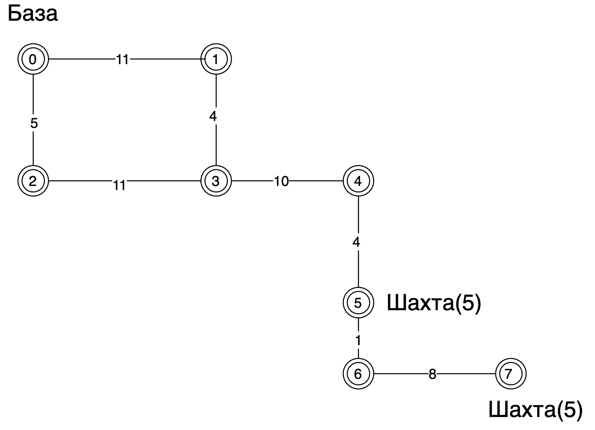

# Программа поиска оптимального маршрута для РГМ-1

## Описание задания

В недалеком будущем человечество начинает освоение Марса. Вы - стажер в команде разработки роботов для подготовки
красной планеты к колонизации. На данный момент на Марс отправлено несколько роботов. Их задача построить базу.

В ваше управление поступает Робот Грузовой Марсианский - 1, сокращенно РГМ-1. Вы получите несколько карт местности с
нанесёнными на ней шахтами и базой. Рядом с шахтами лежат полезные ископаемые (ресурсы), их надо перевести на базу.
Необходимо собрать заданное количество ресурсов и привезти их на базу. Ваша задача: написать приложение на Java, которое
должно уметь составлять оптимальный маршрут перемещения РГМ-1 для любой карты местности.

РГМ-1 вмещает определённое количество кубических метров (включительно). Роботы-погрузчики в шахтах всё сами упакуют. Про
вес и заряд можете не беспокоиться (заряда аккумулятора хватает на месяц автономной работы, робот способен перевозить до
1000 тонн в марсианском притяжении), а вот габариты груза придётся учитывать.

При решении задачи важно сосредоточиться на вычислении оптимальных маршрутов перемещения робота. Загрузка полезных
ископаемых в робота выполняется автоматически, сразу же, по прибытии в точку шахты. Выгрузка ресурсов на базе также
автоматизирована.

### Сбор ресурсов

Вместе с картой, вам передается информация о том, сколько всего ресурсов нужно собрать. Иногда требуемое количество
ресурсов настолько большое, что роботу потребуется возить их на базу частями несколько раз. Робот всегда начинает своё
движение с базы. По сути, есть смысл заканчивать маршрут движения так же на базе, когда выгрузка полезных ископаемых
завершена.

### Способ перемещения

Карта местности описывается как список вершин и ребер неориентированного графа, т.е. если вершины связаны ребром, то по
ним можно перемещаться в обе стороны. Из конкретной вершины можно переместиться только в те вершины, которые с ней
связаны. Длина ребра, т.е. расстояние между двумя вершинами может быть разным и изменяется в заранее заданном количестве
шагов робота. Общее количество шагов перемещения по всем ребрам и определяет насколько оптимальным получится в итоге
маршрут.

## Дедлайн для выполнения

Коммиты принимаются до \
10 марта 2023 года \
23:59 по московскому времени

## Техническое задание

### Формат ввода

На вход подается файл map.json с информацией о карте и требуемом количестве ресурсов в формате JSON вида:

```json
{
  "vertex": [
    {"id": <номер_вершины>, "type": <тип_вершины>[, "resources": <количество_ресурсов>]},
    {"id": <номер_вершины>, "type": <тип_вершины>[, "resources": <количество_ресурсов>]},
     ...
  ],
  "edge": [
    {"start": <номер_вершины>, "stop": <номер_вершины>, "size": <длина_ребра>},
    {"start": <номер_вершины>, "stop": <номер_вершины>, "size": <длина_ребра>},
     ...
  ],
  "robot": {
    "size": <вместимость перевозимых ресурсов роботом>
  },
  "goal": {"resources": <необходимое_число_ресурсов>}
}
```

где:

- vertex - список вершин
- id - идентификатор вершины
- type - тип вершины: base - база, cross - перекресток, mine - шахта
- resources - количество полезных ископаемых в шахте

- robot - информация о параметрах робота
- size - максимальная вместимость перевозимых ресурсов роботом

- edge - список ребер
- start - откуда начинается ребро
- stop - где заканчивается ребро
- size - длина ребра

При этом, граф не ориентированный, такие ребра равнозначны:

```json
{"start": 1, "stop": 2, "size": 10}
{"start": 2, "stop": 1, "size": 10}
```

- goal - какое количество ресурсов необходимо собрать

### Формат вывода

Текстовый файл robot-steps.json с информацией о маршруте робота:

```json
{"path": [<номер_вершины>, <номер_вершины>, <номер_вершины>, ...,<номер_вершины>]}
```

### Пример ввода

Для карты
 \
Текстовый файл map.json с информацией о карте и требуемом количестве ресурсов:

```json
{
  "vertex": [
    {"id": 0, "type": "base"},
    {"id": 1, "type": "cross"},
    {"id": 2, "type": "cross"},
    {"id": 3, "type": "cross"},
    {"id": 4, "type": "cross"},
    {"id": 5, "type": "mine", "resources": 5},
    {"id": 6, "type": "cross"},
    {"id": 7, "type": "mine", "resources": 5}
  ],
  "edge": [
    {"start": 0, "stop": 1, "size": 11},
    {"start": 0, "stop": 2, "size": 5},
    {"start": 1, "stop": 3, "size": 4},
    {"start": 2, "stop": 3, "size": 11},
    {"start": 3, "stop": 4, "size": 10},
    {"start": 4, "stop": 5, "size": 4},
    {"start": 5, "stop": 6, "size": 1},
    {"start": 6, "stop": 7, "size": 8}
  ],
  "robot": {
    "size": 10
  },
  "goal": {"resources": 10}
}
```

### Пример вывода

Текстовый файл answer.json с информацией о маршруте робота:

```json
{"path": [0, 1, 3, 4, 5, 6, 7, 6, 5, 4, 3, 1, 0]}
```

### Способ перемещения

Из вершины можно переместиться только в ту вершину, которая её связывает \
Это потребует столько заряда аккумулятора, какова её длина

## Рекомендуемые материалы для подготовки

1. [Теория графов. Термины и определения в картинках.](https://habr.com/ru/company/otus/blog/568026/)
2. Роберт Сэджвик, Кевин Уэйн. Алгоритмы на Java, 4-е изд.: М.: ООО "И. Д. Вильямс", 2013. - 848 с.

## Критерии и шкала оценки

Критерии оценивания по приоритету:

1. В верх таблицы попадает тот, чей алгоритм решил больше всех задач. То есть помог РГМ-1 перевести на базу необходимое
   число ресурсов по разрешенному маршруту.
2. Из всех участников, которые решили одинаковое число задач выше попадает тот, кто по сумме всех карт прошёл самый
   короткий маршрут.
3. Из тех, у кого равное число пройденных маршрутов и их длина выше становится тот, у кого количество переходов от
   вершины к вершине минимальное.
4. Если все предыдущие три критерия совпадают, то приоритет отдаётся тому, кто отправил код в репозиторий первым.
   Смотрим по последнему коммиту в репозиторий в ветку main.

После дедлайна приложения запустят на автотестах (см. формат испытаний) с полным набором карт \
Участники, занявшие в таблице первые 15 мест - проходят в финал

## Этический кодекс

Нам хочется, чтобы вы самостоятельно выполнили работу. \
Мы не принимаем решения, в которых используются специализированные библиотеки для решения алгоритмических задач.

Просьба не деконструировать автотесты. Не пытайтесь модифицировать конвейер сборки и проверки. Стенд нам ещё
понадобится. \
Ваша задача - написать эффективный алгоритм передвижения, а не исследовать уязвимости системы.